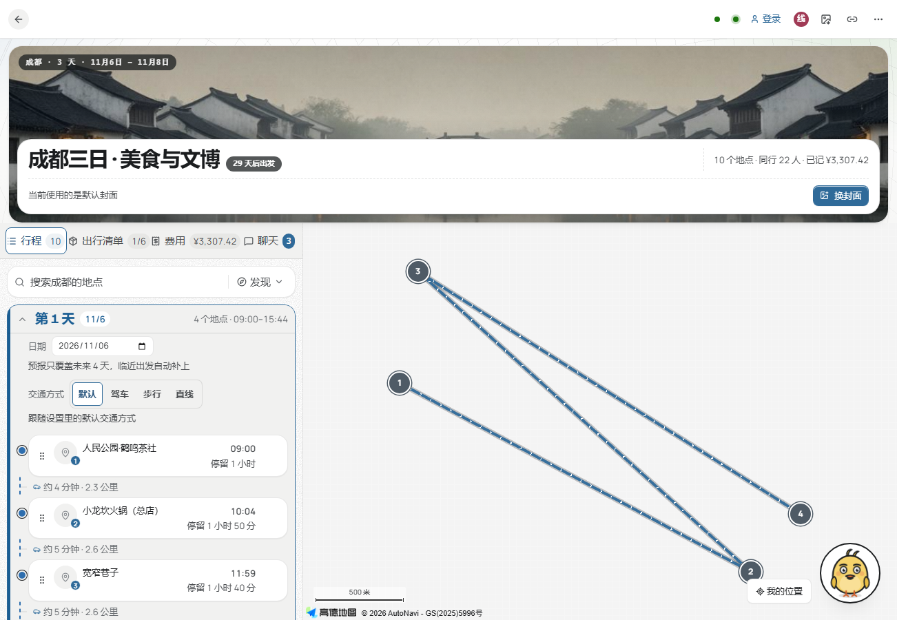
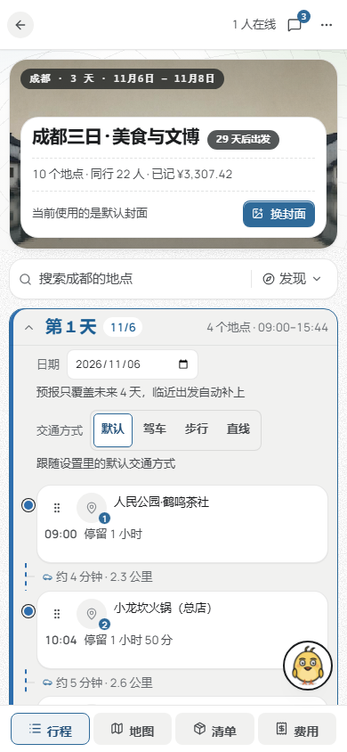

# TourPlanOpt

多人实时协作的行程规划工具：**一个链接进来，几个人同时改同一份行程；一天的地点顺序自动排成最省时的路线。**

它管的是两件具体的事——几个人的意见对不齐，以及一天七八个地点的先后顺序算不清。

**在线使用 → <https://chengrm.online/tourplanopt>**（手机浏览器「添加到主屏幕」即可当应用用；它先是作者自己出游在用的工具）

下面这张图就是行程页本来的样子：上面是封面与这趟的概况，左边当天的时间线，右边地图上的路线与同伴位置。

## 三件事

### 一起排：不用再截图往群里丢

打开同一个链接就能同时改同一份行程。朋友加了宽窄巷子，你这边卡片就出现了；谁正在编辑哪一张、谁的头像停在地图上哪一站，当场看得见。中途断网或切到后台，回来时落下的改动和留言会自动补齐。

留言挂在「哪天哪一站」上。问一句「这家要不要留、挪到下午行不行」，上下文就在旁边，不必另开一个群。

### 排得顺：不用自己对着地图量先后

七八个地点，一键排成当天最省时的顺序。想留住某一站、规定从酒店出发、或者要求在火锅店收队，都能先钉住再排其余的。

改完不必特意点「优化」：任何增删改之后，当天的到达与离开时间就地重算并同步给所有人——几点到、几点走、路上花多久，时间线始终是完整的，和固定时间的安排冲突时会提示。

默认按直线距离排，零成本；要看真实路况时切成驾车或步行，反复排同一天也不会反复消耗调用额度。

### 走得完：不用把清单、钱、天气散在三个应用里

出行清单、预算与 AA 结算、每天的天气、想去清单都在同一份行程里。

钱的部分做到能直接收尾：每笔记清谁分摊，按人头折算成谁该给谁多少，给出最少笔数的转账建议，明细可以一键复制成群聊里看得懂的文本。

首页回答的不是「最近编辑了哪趟」，而是「这趟还差什么」：几天后出发、清单还差几项、钱花到哪了。日期走完却还没结算的那趟会顶在最前面，可以一次全部收尾。

手机上同样能用，页签与抽屉按触屏重排过：

## 技术栈

Vue 3 · Pinia · TypeScript · Vite · sortablejs ｜ Python FastAPI · 原生 WebSocket · Pydantic · SQLite（WAL，无 ORM）｜ 高德开放平台（JS API 与 Web 服务两套 Key）｜ Docker Compose + Caddy

## 许可

见 LICENSE。
